# Setup

In this part you are going to:

1. Create your Microsoft Azure account
2. Connect to the lab environment using SSH
3. Connect to your Microsoft Azure account
4. Deploy your Kubernetes cluster using Azure Container Service

## 1. Create your Microsoft Azure account

*If you already have a Microsoft Azure account that you can use for the hands-on-lab, you can skip this step.*

Open a new **In Private** or **Incognito** browser session and go to <https://www.microsoftazurepass.com>


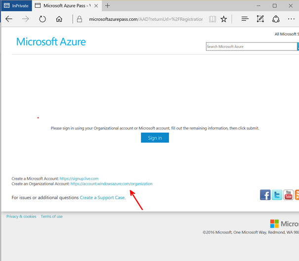

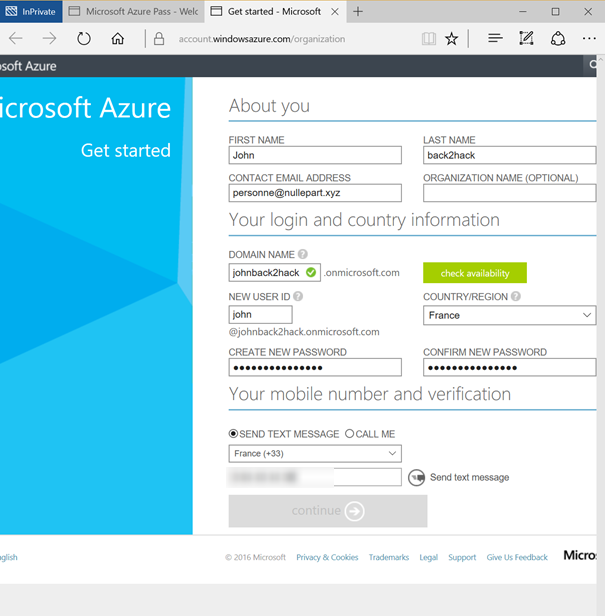

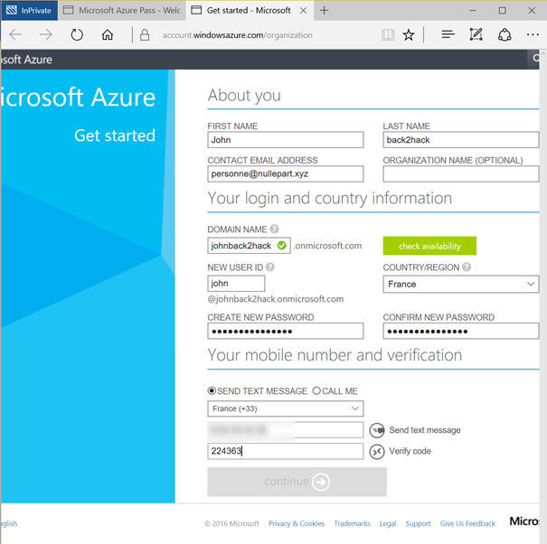

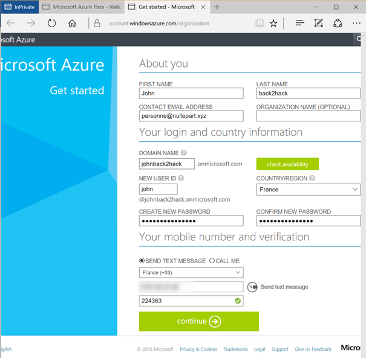


Close the tab on the right (it would lead you to free trial that asks for a Credit Card), 
and use the first tab to continue on with your newly created organizational account.


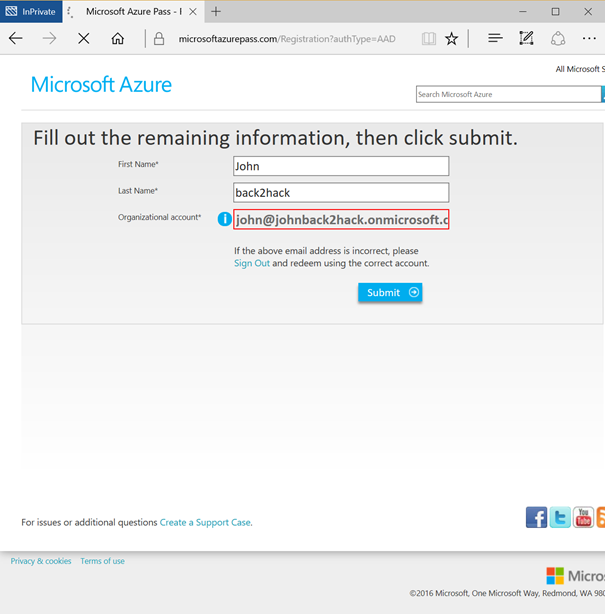

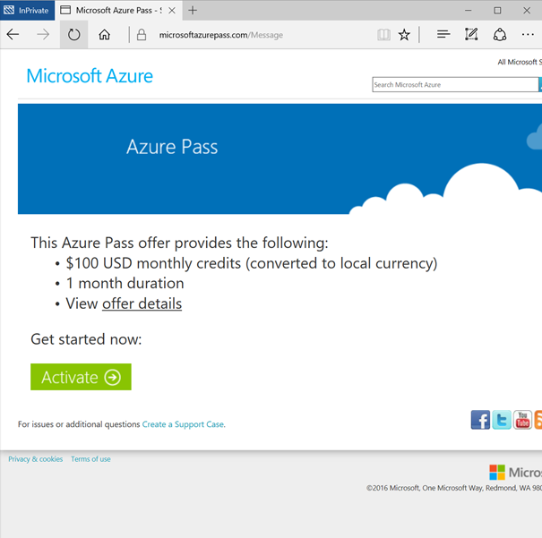

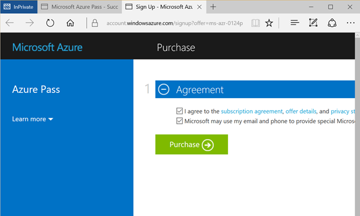

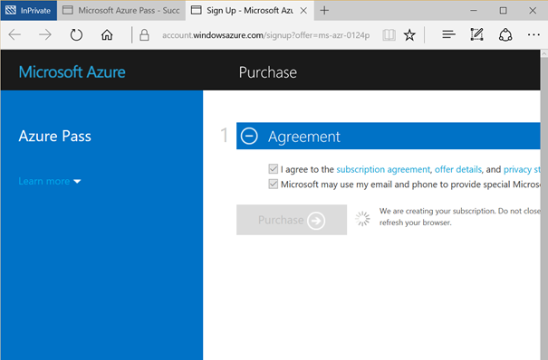

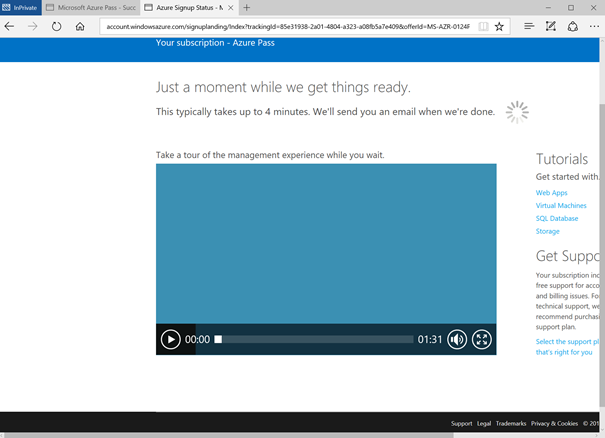


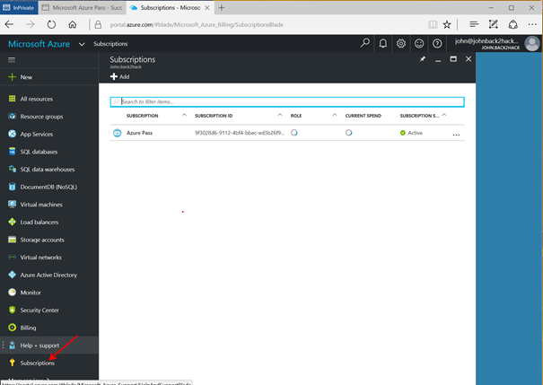

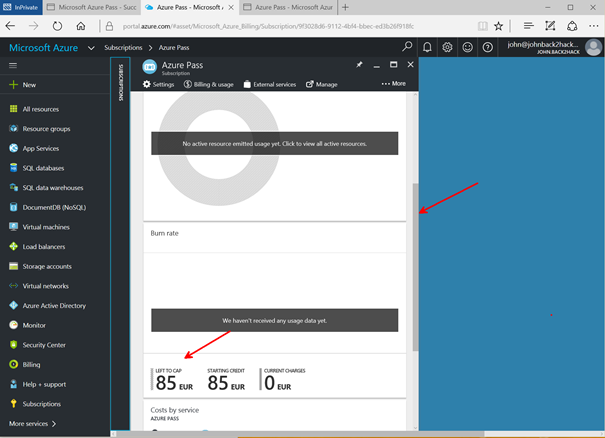

Your Microsoft Azure account is now ready.

## 2. Connect to the lab environment using SSH

You have been assigned to a SSH endpoint that will allow you to enter the lab environment. The two important information are:

- The port you have been assigned
- The SSH endpoint

The following steps will guide you to create the ssh connection depending on you are running Windows, macOS or Linux on your laptop.

### Windows

1. Download and install putty from [here](https://the.earth.li/~sgtatham/putty/latest/w32/putty-0.68-installer.msi)
2. Open Putty and enter your connection information. Enter a name for the session, click **Save** then **Open**


3. Click Yes on the security alert popup that opens
4. Enter root's password: `P@ssw0rd!`
5. You are now connected:


### macOS or Linux

Open a terminal and type:

```bash
ssh -p 22XX root@ASK_DNS_TO_PROCTOR.COM
```

When asked, enter the root's password: `P@ssw0rd!`. And you are connected!

## 3. Connect to your Microsoft Azure account

Once connected into the lab environment, you need to authenticate with your Microsoft Azure account using Azure CLI 2.0:

```bash
az login
```

A code will be generated for you. Go to [https://aka.ms/devicelogin](https://aka.ms/devicelogin), enter the code and authenticate with you credentials (the one you have used to create your Microsoft Azure account during step 1.)


## 4. Deploy your Kubernetes cluster using Azure Container Service

Deploying a Kubernetes cluster in Microsoft Azure is really easy using Azure CLI 2.0.

### Set the default Azure account to use

First, list your Azure subscriptions using:

```bash
az account list -o table
```

Copy the *SubscriptionId* of the Azure subscription you want to use and make sure it is the default option using:

```bash
az account set --subscription "REPLACE_WITH_YOUR_SUBSCRIPTION_ID"
```

### Deploy Kubernetes

The first step consists into create a resource group which is a logical entity in Azure that allows to regroup resources that are linked together.

Create a resource group named *devoxx-k8s-rg* in the West Europe Azure datacenter, use:

```bash
az group create --name="devoxx-k8s-rg" --location="westeurope"
```

Open the script `/root/scripts/create-k8s-cluster.sh` with nano:

```bash
nano /root/scripts/create-k8s-cluster.sh
```

And update the option **YOUR_DNS_PREFIX**, for example with YOURNAME-k8s:

```bash
az acs create --resource-group "devoxx-k8s-rg" \
  --location "westeurope" \
  --name "devoxx-k8s" \
  --orchestrator-type "kubernetes" \
  --dns-prefix "YOUR_DNS_PREFIX" \
  --agent-count 2 \
  --master-count 1 \
  --generate-ssh-keys
```

Exit and save the file (CTRL+X then Y then ENTER). 
This script uses Azure CLI 2.0 to generate all the stuff needed for the deployment (SSH keys, Azure Service Principal...) and then deploy the cluster.

Execute the script:

```bash
cd /root/scripts
./create-k8s-cluster.sh
```

The wait for the deployment to be completed.
It can take several minutes.

### Get credentials to connect to the Kubernetes cluster

Once the cluster has been provisionned, you can get the credentials and kubectl config using the following command:

```bash
az acs kubernetes get-credentials -n "devoxx-k8s" -g "devoxx-k8s-rg"
```

It will download everything for you. Then you can test the connection to the cluster using the `kubectl` command:

```bash
root@32322bbcf593:~/scripts# kubectl version
Client Version: version.Info{Major:"1", Minor:"4", GitVersion:"v1.4.5", GitCommit:"5a0a696437ad35c133c0c8493f7e9d22b0f9b81b", GitTreeState:"clean", BuildDate:"2016-10-29T01:38:40Z", GoVersion:"go1.6.3", Compiler:"gc", Platform:"linux/amd64"}
Server Version: version.Info{Major:"1", Minor:"5", GitVersion:"v1.5.3", GitCommit:"029c3a408176b55c30846f0faedf56aae5992e9b", GitTreeState:"clean", BuildDate:"2017-02-15T06:34:56Z", GoVersion:"go1.7.4", Compiler:"gc", Platform:"linux/amd64"}
root@32322bbcf593:~/scripts#
root@32322bbcf593:~/scripts#
root@32322bbcf593:~/scripts# kubectl get nodes
NAME                    STATUS                     AGE
k8s-agent-8236386e-0    Ready                      1m
k8s-agent-8236386e-1    Ready                      1m
k8s-master-8236386e-0   Ready,SchedulingDisabled   1m
root@32322bbcf593:~/scripts#

```

If all work well, you should see the client and server version as the output of the `kubectl version` command and the list of nodes as the output of the `kubectl get nodes` command.

**Note: if you have changed the name of the resource group and the name of the cluster in the deployment script, you can list your cluster using:**

```bash
az acs list -o table
```

Your Kubernetes cluster is now up and running on Microsoft Azure!