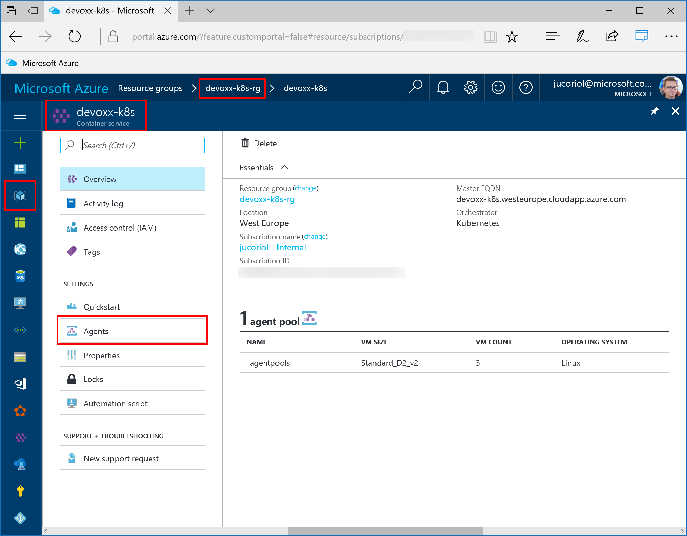

# Scale the application

*You must have completed the [Part 2](https://github.com/jcorioland/mobile-deposit-api-devoxx2017/blob/master/README.md) before doing this part.*

In this part, your are going to learn how to:

1. Use `kubectl` to scale the application
2. Use `Azure CLI 2.0` or the Azure portal to scale the infrastructure that executes the cluster

## 1. Use `kubectl` to scale the application

By deploying the application using Jenkins in the previous part, you have several resources that are running in Kubernetes:

A deployment, that you can show using:

```bash
kubectl get deployment
```

This deployment is composed by a replica set, that you can show using:

```bash
kubectl get rs
```

This replica set is composed by a collection of pods (one, after the deployment). You can show it using:

```bash
kubectl get pods
```

Finally, there is service that expose the pod outside the cluster. You can show it using:

```bash
kubectl get svc
```

At any moment you can ask kubernetes to deploy more pods in your deployment that will be automatically load balanced behind the service. You can do it using the following command:

```bash
kubectl scale --replicas=5 deployment/mobile-deposit-api
```

Now, if you list pods again, you will see than five of them are running:

```bash
jcorioland@jucoriol-sp4:~$ kubectl get pods
NAME                                  READY     STATUS    RESTARTS   AGE
mobile-deposit-api-1840895939-1t0m7   1/1       Running   0          1m
mobile-deposit-api-1840895939-4rhvm   1/1       Running   0          1m
mobile-deposit-api-1840895939-ct0xs   1/1       Running   0          11m
mobile-deposit-api-1840895939-m74zp   1/1       Running   0          1m
mobile-deposit-api-1840895939-m9vwh   1/1       Running   0          1m
```

## 2. Use `Azure CLI 2.0` or the Azure portal to scale the cluster

In the previous part, you have learned how to scale the number of pods that execute an app in a Kubernetes cluster. In some cases, you may want to be able to scale the infrastructure that runs the cluster itself.

With Azure Container Service, you can do it very easily using the *Azure CLI 2.0* or the Azure portal.

### 2.1 Scale the cluster using the Azure CLI 2.0

First, list the ACS cluster that are running in your Microsoft Azure subscription:

```bash
az acs list -o table
```

Then, use the scale command as the following:

```bash
az acs scale -n devoxx-k8s -g DEVOXX-K8S-RG --new-agent-count=3
```

Where:

- `n` is the name of the container service you want to scale
- `g` is the name of the resource group
- `--new-agent-count` is the number of agent you want in the cluster

In the command above, we ask for 3 agents so Azure Container Service will add one more virtual machine in the cluster and register it with the orchestrator.

After a while, once the virtual machine has been created and has joined the Kubernetes cluster, you list the nodes that compose your cluster:

```bash
kubectl get node
```

You can see that the cluster is now composed by four nodes: one master and three minions.

### 2.2 Scale the cluster using the Microsoft Azure portal

The other solution to scale the cluster is to use the portal.

1. Browse [https://portal.azure.com]
2. Authenticate with your Microsoft Azure Credentials
3. Browse the resource group where you have created the cluster
4. Find the resource of type Container Service and click on the Agents menu entry on the left




From there, you can just update the number of agents and click save to add/remove virtual machines:


